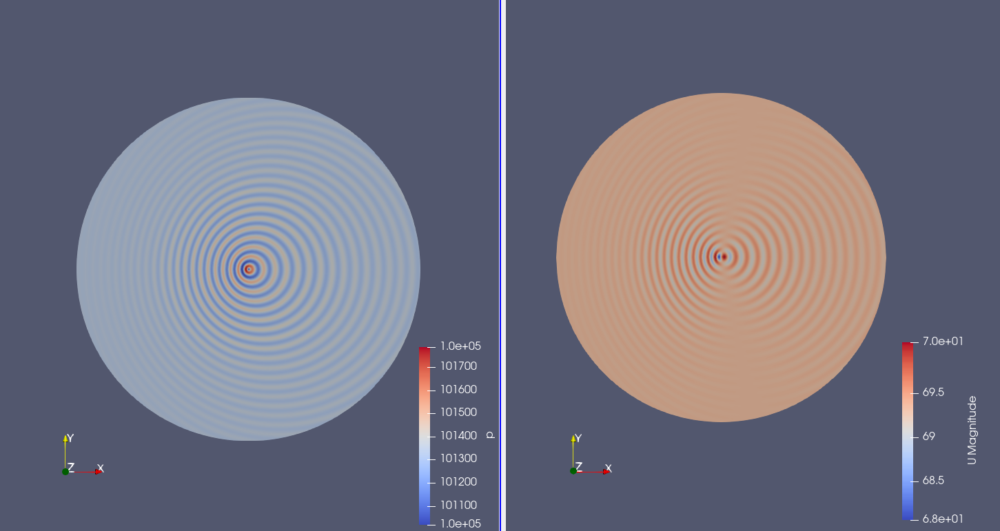

# Aeroacoustics Analysis of Monopole in a Uniform Flow

This is the repository for my Undergraduate Thesis project, which aims to investigate errors in the direct calculation of noise from an acoustic monopole in a uniform flow. The project involves numerical simulations using the open-source computational fluid dynamics software OpenFOAM to analyze the performance of mesh configurations, refinement, and the effect of varying classical numerical schemes in Computational Fluid Dynamics (CFD).

The main objectives of the project are to:

- To characterize the acoustic monopole in a flow.
- To understand the effects of discretization and mesh refinement on the solution of the monopole in a flow.
- To evaluate the influence of different numerical schemes on the dispersion and dissipation of sound waves in a non-stationary medium.

The code in this repository includes the simulation setup and post-processing scripts for the OpenFOAM simulations. The full document can be acessed [here](https://repositorio.ufsc.br/handle/123456789/255894).

## Keywords
Computational Aeroacoustics. Acoustic Monopole. OpenFOAM

***
***
# Análise Aeroacústica de um Monopolo em meio ao Escoamento Uniforme
Este é o repositório para o meu projeto de Trabalho de Conclusão de Curso, que tem como objetivo investigar erros no cálculo direto de ruído de um monopolo acústico em meio ao escoamento uniforme. O projeto envolve simulações numéricas usando o software de dinâmica dos fluidos computacional de código aberto OpenFOAM para analisar o desempenho de configurações de malha, refino e efeito da variação de esquemas numéricos clássicos em Fluidodinâmica Computacional (CFD).

Os principais objetivos do projeto são:

- Caracterizar o monopolo acústico em meio ao escoamento.
- Conhecer os efeitos de discretização e refino de malha na solução do monopolo em meio ao escoamento.
- Avaliar influência de diferentes esquemas numéricos na dispersão e dissipação de ondas sonoras em meio não estacionário.

O código neste repositório inclui a configuração da simulação e os scripts de pós-processamento para as simulações do OpenFOAM. O documento completo pode ser acessado [aqui](https://repositorio.ufsc.br/handle/123456789/255894).

## Palavras-chave
Aeroacústica Computacional. Monopolo Acústico. OpenFOAM.

